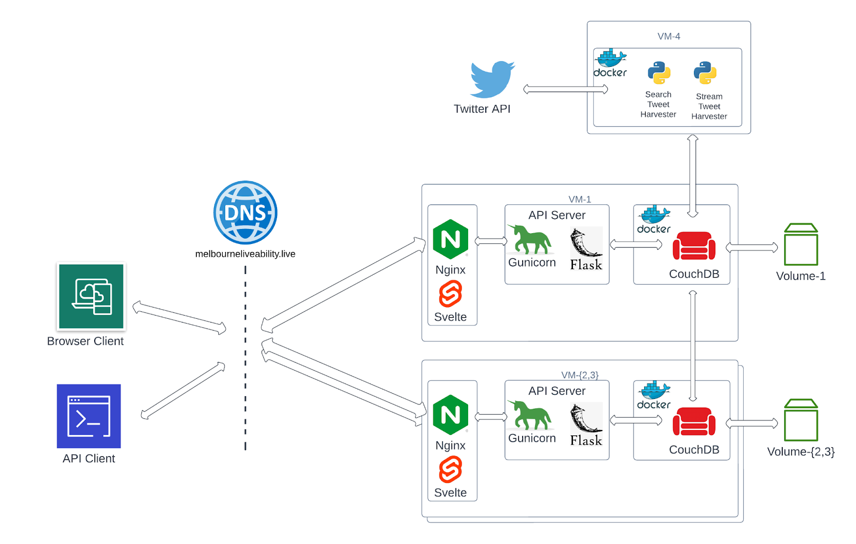

# James Sinclair

Melbourne, Australia

[GitHub](https://github.com/jsinkers)

[Linkedin](https://www.linkedin.com/in/james-sinclair-a1a60a7a)

## Experience

### PassBox

Engineer/Partner, 2017 - present

### Boeing Research and Technology - Australia

Composites Research Engineer, Mar 2015 - Dec 2018

## Education

### Master of Computer Science

University of Melbourne, 2020-present

### Bachelor of Engineering (Aerospace)

UNSW, 2009-2013

1st Class Honours and University Medal

### Bachelor of Science (Physics)

UNSW, 2009-2013

## Projects

### [PassBox](http://passbox.org/map)

PassBox conducts research in cycling and pedestrian safety. Using the PassBox device that I have developed, we
collect data from cyclists around Australia on how close they are passed by other vehicles. Collected data is reduced to passing events using software I have implemented. Passing events are then used to build models assessing the impact of advertising campaigns, explore different cycling infrastructure, and assess
the effect of passing distance laws. I have presented our findings at several international conferences.

<!-- image of passbox device -->

#### Are bicycle lanes effective?

[Are bicycle lanes effective? The relationship between passing distance and road characteristics](https://www.sciencedirect.com/science/article/pii/S0001457521002153), Accident Analysis and Prevention · Jun 14, 2021

By Jonathan Nolan, James Sinclair, Jim Savage

We have conducted the largest on-road study of passing distance on public roads to date, collecting data from 162 cyclists in Victoria and Western Australia, producing over 46,000 passing events. In this publication we found that protected bicycle lanes are 10 times more effective than painted bicycle lanes, and that painted bicycle lanes are better than no bicycle lane at all.

### Melbourne liveability

Team project, Cluster and Cloud Computing, 2022

As a team of 5, we implemented a web-app deployed on the cloud to explore liveability in Melbourne, presenting data on maps and charts. We explored social engagement and opportunity liveability indicators using a combination of government datasets and tweets that we harvested. We deployed 4 VMs on the Melbourne Research Cloud using Ansible, with a 3-node CouchDB cluster. 

<!--  -->
#### Architecture

- [source](https://github.com/jsinkers/comp90024-assignment-2)
- [site demo video](https://youtu.be/_TJ7u7xXZpU)
- [Ansible deployment video](https://youtu.be/s9CQWb1iy7U)

### Agent-based modelling

2021

As a group of 3, we implemented a ground-up agent-based model of wealth inequality in Java, replicating a NetLogo model. We then extended the model to examine the effect of inheritance on wealth distribution.

- [source](https://github.com/jsinkers/mcss-assignment-2)
<!--- report-->

### [Register Machine](registermachine.com)

2019

A personal project exploring computation using a register machine and learning about Vue and deployment. A register machine is a Turing-complete model of computation that's a bit easier to follow than a Turing
machine. The web-app gives some tutorials and allows you to solve challenges by writing
programs for the register machine. This project was implemented using Vue, with a client-side interpreter of the register machine programs, and was deployed using Heroku.

- [source](https://github.com/jsinkers/register-machine)
- [video](https://youtu.be/9eTyqoDCcc4)

### Bonus

- [More Projects](ProjectArchive.md#more-projects)
- [Side Projects](ProjectArchive.md#side-projects)

## Skills

### Languages

Python, Java, C, JavaScript, Haskell, R

### Frameworks

- Python: Flask, Django
- JavaScript: Vue, Svelte

### Databases

MySQL, PostgreSQL, CouchDB, SQLite

### Other

Git, Docker, Ansible, AWS, Arduino

### Course work - Computer science

Graduate level courses completed in:

- Cluster and cloud computing
- Software project management  
- Machine learning and artificial intelligence planning
- Concurrency and modelling complex systems
- Quantum computing
- Cryptocurrencies and decentralised ledgers

Undergraduate courses completed in:

- Algorithms and data structures
- Object-oriented and declarative programming
- Networks and operating systems
- Databases
- Numerical methods
- Models of computation

### Engineering

- Computer-aided design: Catia
- Net Present Value analysis/trade studies
- Prototyping: electromechanical, composite structures
- Design for additive manufacturing
- Finite element modelling: Patran/Nastran, Abaqus

## Patents

[Curved heat shrink tubing and methods of making the same](https://patents.google.com/patent/US20190168427A1/en)
